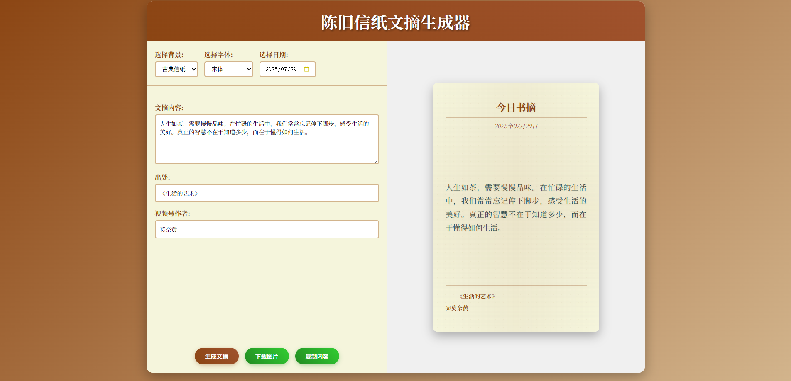

# 陈旧信纸文摘生成器



一个优雅的古典风格文摘生成器，支持多种信纸背景和字体选择。纯前端实现，无需安装任何软件，直接在浏览器中使用。

## 功能特性

- 🎨 多种古典信纸背景（古典信纸、羊皮纸、牛皮纸、竹简纸）
- ✍️ 多种字体选择（宋体、马善政楷体、站酷快乐体）
- 📅 可选择日期显示
- 💾 支持下载为高清PNG图片
- 📋 一键复制内容
- 📱 响应式设计，支持移动端
- 🌐 纯前端实现，无需后端服务器

## 在线使用

### 方法一：本地文件直接打开

直接双击 `index.html` 文件即可在浏览器中打开使用。

### 方法二：本地HTTP服务器（推荐）

为了获得最佳体验，建议使用本地HTTP服务器：

```bash
# 使用Python内置服务器
python -m http.server 8000

# 或使用Node.js的http-server
npx http-server -p 8000

# 然后在浏览器中访问
http://localhost:8000
```

### 方法三：在线部署

可以将项目部署到任何静态网站托管服务：
- GitHub Pages
- Netlify
- Vercel
- 阿里云OSS
- 腾讯云COS

## 项目结构

```
paper-gen/
├── index.html          # 主页面
├── styles.css          # 样式文件
├── script.js           # JavaScript逻辑
└── README.md          # 说明文档
```

## 技术栈

- **前端**: HTML5, CSS3, JavaScript (ES6+)
- **图片生成**: html2canvas库
- **字体**: 网络字体 + 系统字体
- **样式**: 纯CSS实现，无依赖框架

## 使用说明

1. **选择背景**: 从下拉菜单中选择喜欢的信纸背景
2. **选择字体**: 选择合适的字体样式
3. **选择日期**: 可以选择特定日期或使用当前日期
4. **输入内容**: 填写文摘内容、来源和作者
5. **生成文摘**: 点击"生成文摘"按钮预览效果
6. **导出**: 可以下载为高清PNG图片或复制文本内容

## 浏览器兼容性

- ✅ Chrome 60+
- ✅ Firefox 55+
- ✅ Safari 12+
- ✅ Edge 79+
- ✅ 移动端浏览器

## 特色功能

### 高质量图片下载
- 使用html2canvas库生成高清图片
- 支持透明背景
- 2倍分辨率输出，确保打印质量
- 自动生成带时间戳的文件名

### 响应式设计
- 自适应不同屏幕尺寸
- 移动端友好的触控体验
- 优雅的动画效果

### 无依赖部署
- 纯静态文件，无需数据库
- 无需服务器端处理
- 可部署到任何CDN或静态托管服务

## 自定义扩展

### 添加新背景
在 `styles.css` 中添加新的背景样式：

```css
.paper-background.new-style {
    background-image: url('your-background.jpg');
    /* 其他样式 */
}
```

### 添加新字体
在 `script.js` 中的字体列表添加新选项，并在CSS中定义字体样式。

## 许可证

MIT License - 可自由使用、修改和分发。